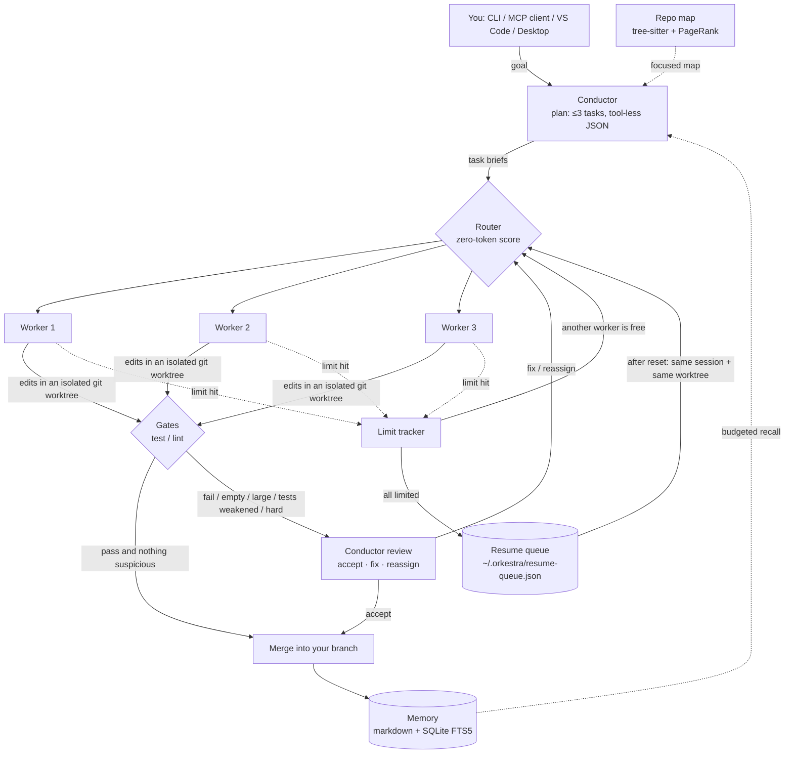

<p align="center"></p>

<h1 align="center">Super Orkestra 🎼</h1>

<p align="center">
  <b>Your strongest model conducts. Three worker models of your choice write the code.</b><br>
  An open-source orchestrator for AI coding CLIs that aims for <b>high-quality code with as few tokens and subscription limits as possible</b>.
</p>

<p align="center">
  <a href="https://github.com/cumabozkurt/super-orkestra/actions/workflows/ci.yml"></a>
  <a href="https://github.com/cumabozkurt/super-orkestra/releases/latest"></a>
  <a href="LICENSE"></a>
  
  
  
</p>

<p align="center">
  <b>English</b> · <a href="README.tr.md">Türkçe</a> · <a href="docs/README.md">Documentation</a>
</p>

---

Super Orkestra is a TypeScript monorepo that puts one **conductor** model in charge of several **worker** models. The conductor splits a goal into a small plan and decides who does what. Each worker runs headless (Claude Code, Codex, Gemini CLI, opencode, or OpenRouter) inside its **own git worktree**. Test/lint **gates** check the result. If the gates pass and nothing looks suspicious, the conductor never wakes up again. If something goes wrong, the conductor reviews the diff and says *fix* or *reassign*.

When a subscription hits its 5-hour or weekly limit, the task moves to another worker. If every worker is limited, the task waits in a persistent queue. When the limit resets, it **continues in the same CLI session, in the same worktree**. Half-finished work is never thrown away.

## Contents

- [Features](#features)
- [How it works](#how-it-works)
- [Quick start](#quick-start)
- [Configuration](#configuration)
- [Commands](#commands)
- [Integrations](#integrations): MCP · VS Code · Desktop
- [Packages](#packages)
- [Verification and known limitations](#verification-and-known-limitations)
- [Roadmap](#roadmap)
- [Contributing](#contributing) · [Security](#security) · [License](#license)

## Features

- **Works with the coding CLIs you already pay for.** Workers can be Claude Code, Codex, Gemini CLI, or opencode. They use headless CLI mode or the [Agent Client Protocol](https://agentclientprotocol.com) (ACP) with automatic fallback. OpenRouter models also work through an API key. The CLIs use your existing logins.
- **Token-frugal conductor.** The conductor runs headless with **no tools**. It gives one JSON answer per turn and never reads files. It sees only a focused repo map, the memory relevant to the goal, the diff, and gate output. Workers get a short brief (the plan asks for ≤120 words of context). A fix goes back to the worker that wrote the code. `budget.maxTokensPerTask` caps each task.
- **Isolation by default.** Every task runs in its own git worktree under `~/.orkestra/worktrees/`. Accepted work is merged with `--no-ff`. Rejected work is discarded.
- **Gates before reviews.** Gates can be configured or detected automatically (`npm test`, `cargo test`, `go test`, `pytest`). The conductor reviews only when a gate fails, the diff is empty or large, the task is `hard`, the worker reported failure, or existing tests were deleted or weakened.
- **Limit tracking and auto-resume.** Claude Code reports through a statusline hook (`rate_limits`). Codex is read from rollout logs. Every agent's error output is scanned for 429, "try again in…" and "resets 3pm (Europe/Istanbul)". When a worker is limited, its task is handed off. If all workers are limited, a persistent queue resumes the same session when the limit resets.
- **Persistent project memory.** A markdown memory bank plus a searchable SQLite FTS5 fact store (built-in `node:sqlite`, no extra database). Memory is injected within a token budget.
- **Repo map.** Definitions come from tree-sitter for 12 languages, with a regex fallback. Files are ranked with PageRank over the cross-file reference graph and personalized toward the goal.
- **Use it from anywhere:** CLI · MCP server (Claude Code, Codex, VS Code, and other MCP clients) · VS Code extension (`@orkestra` chat participant) · Tauri desktop app for Windows, macOS, and Linux.

## How it works



For the full picture (routing formula, review triggers, the resume decision table, and on-disk layout), see **[docs/architecture.md](docs/architecture.md)**.

## Quick start

> [!NOTE]
> **v1.0.0 is out on [GitHub Releases](https://github.com/cumabozkurt/super-orkestra/releases/latest)** with the CLI tarballs, the VS Code `.vsix` and desktop installers for Windows, macOS and Linux. The packages are not on the npm registry, the VS Code Marketplace or Open VSX yet, so install them from the release as shown below.

**Requirements:** Node.js **≥ 22.16** (needs the built-in `node:sqlite` with FTS5), git, and at least one agent CLI you are logged into.

```bash
# 1) The agent CLIs you want to use (any subset)
npm i -g @anthropic-ai/claude-code @openai/codex @google/gemini-cli opencode-ai

# 2) Super Orkestra CLI from the v1.0.0 release (both tarballs in ONE command)
npm i -g https://github.com/cumabozkurt/super-orkestra/releases/download/v1.0.0/super-orkestra-core-1.0.0.tgz \
         https://github.com/cumabozkurt/super-orkestra/releases/download/v1.0.0/super-orkestra-1.0.0.tgz
super-orkestra --version          # 1.0.0 — `orkestra` is the short alias

# 3) Run it in your project (a git repository)
cd ~/code/my-project
super-orkestra run "add 2FA to the login page and write tests for it"
```

<details>
<summary>Install from source instead</summary>

```bash
git clone https://github.com/cumabozkurt/super-orkestra.git && cd super-orkestra
npm install && npm run build
npm link -w super-orkestra        # puts `super-orkestra` and `orkestra` on your PATH
```
</details>

### Downloads (v1.0.0)

Everything is attached to the **[latest release](https://github.com/cumabozkurt/super-orkestra/releases/latest)**. `SHA256SUMS.txt` lists the checksum of every file.

| Component | Files | Install |
|---|---|---|
| CLI + MCP server | `super-orkestra-core-1.0.0.tgz`, `super-orkestra-1.0.0.tgz` | the `npm i -g …` line above (the CLI needs the core tarball next to it) |
| VS Code extension | `super-orkestra-vscode-1.0.0.vsix` | `code --install-extension super-orkestra-vscode-1.0.0.vsix`, or Extensions → `…` → *Install from VSIX…* |
| Desktop app · Windows | `.msi`, `-setup.exe` | run the installer |
| Desktop app · macOS | `.dmg` (`aarch64` = Apple Silicon, `x64` = Intel) | open the `.dmg` and drag the app to Applications |
| Desktop app · Linux | `.AppImage`, `.deb`, `.rpm` | `chmod +x` the AppImage, or install the package |

The desktop builds are **not code-signed**. Windows SmartScreen may ask you to confirm (*More info → Run anyway*). On macOS, right-click the app → *Open* the first time, or run `xattr -dr com.apple.quarantine "/Applications/Super Orkestra.app"`. The desktop app and the VS Code extension both drive the CLI, so install the CLI first.

No configuration file is needed. The defaults are a Claude Code conductor and Claude Code / Codex / opencode workers, with gates detected from the project. To choose your own conductor and workers, copy [`orkestra.config.example.json`](orkestra.config.example.json) into your project as `orkestra.config.json`.

**Free, no-login trial:** [`examples/free-opencode.config.json`](examples/free-opencode.config.json) uses opencode's free models for the conductor and all three workers.

➡️ Step-by-step guide: **[docs/getting-started.md](docs/getting-started.md)**

## Configuration

`orkestra.config.json` in the project root is merged with the defaults and validated on load:

```jsonc
{
  "conductor": { "agent": "claude-code", "model": "opus" },        // claude-code | codex | gemini | opencode
  "workers": [                                                       // order matters: strongest first, cheapest last
    { "id": "w1", "agent": "claude-code", "model": "sonnet", "strengths": ["refactor", "feature", "multi-file"] },
    { "id": "w2", "agent": "codex", "model": "", "strengths": ["bugfix", "tests"] },
    { "id": "w3", "agent": "opencode", "model": "opencode/big-pickle", "strengths": ["docs", "small-edit", "boilerplate"] }
  ],
  "providers": { "openrouter": { "apiKeyEnv": "OPENROUTER_API_KEY" } },
  "gates": ["npm test --silent"],                                    // omit to auto-detect
  "budget": { "maxTokensPerTask": 60000, "maxRetries": 2 },
  "limits": { "pauseAtPercent": 95, "resumeDelaySec": 60, "allowAccountFailover": false },
  "memory": { "dir": ".orkestra/memory", "maxInjectTokens": 1200 }
}
```

Every field, the per-worker `transport` option (`auto` / `acp` / `cli`), and all `ORKESTRA_*` environment variables are documented in **[docs/configuration.md](docs/configuration.md)**.

## Commands

`orkestra` is an alias of `super-orkestra`.

| Command | What it does |
|---|---|
| `super-orkestra run <goal>` | Plan → dispatch → gate → review → merge. `run -` reads the goal from `ORKESTRA_INPUT` or stdin |
| `super-orkestra mcp` | Start the MCP server on stdio |
| `super-orkestra resume-daemon` | Keep running and resume queued tasks (from all projects) when their limits reset |
| `super-orkestra limits` | Current 5-hour / weekly limit state as JSON |
| `super-orkestra usage` | Token and cache usage of this project as JSON |
| `super-orkestra models [--free]` | Discover opencode and OpenRouter models |
| `super-orkestra map [-t <tokens>] [-f <focus>]` | Print the ranked repo map |
| `super-orkestra remember <text>` / `recall <query>` | Write to or search the project memory (`-` reads stdin) |
| `super-orkestra statusline` | Claude Code statusline hook that records `rate_limits` |

Full reference with examples and exit codes: **[docs/cli.md](docs/cli.md)**.

## Integrations

**MCP server.** Exposes `orkestra_delegate`, `memory_recall`, `memory_remember`, `repo_map` and `limits_status` to any MCP client:

```bash
claude mcp add super-orkestra -- super-orkestra mcp
codex mcp add super-orkestra -- super-orkestra mcp
```

**Live Claude limits.** Add this to `~/.claude/settings.json`:

```json
{ "statusLine": { "type": "command", "command": "super-orkestra statusline" } }
```

**VS Code extension.** Adds the `@orkestra` chat participant (`/limits`, `/usage`, `/recall`), registers the MCP server automatically, and shows limits in the status bar. Build it with `npm run package:vscode` and install the `.vsix`. → [docs/vscode-extension.md](docs/vscode-extension.md)

**Desktop app.** Tauri 2 + React 19, with tabs for Task, Usage, Limits, Memory and Models. It drives the CLI, so the CLI must be installed. → [docs/desktop-app.md](docs/desktop-app.md)

## Packages

| Package | Path | Description |
|---|---|---|
| [`super-orkestra`](packages/cli) | `packages/cli` | The CLI (`super-orkestra` / `orkestra`) and the Claude Code statusline hook |
| [`super-orkestra-core`](packages/core) | `packages/core` | Conductor, router, workers (CLI / ACP / OpenRouter), worktrees, gates, memory, repo map, limits, MCP server |
| [`super-orkestra-vscode`](packages/vscode) | `packages/vscode` | Thin VS Code extension: chat participant, MCP registration, status bar |
| [`super-orkestra-desktop`](packages/desktop) | `packages/desktop` | Tauri 2 + React desktop app (private, not published to npm) |

```
super-orkestra/
├── packages/{core,cli,vscode,desktop}
├── tests/                 # vitest: unit + integration tests with fake agent CLIs (no accounts needed)
├── scripts/               # smoke test with a real opencode model, limit scenarios, set-repo helper
├── examples/              # ready-to-copy configs
└── docs/                  # user docs + research reports that informed the design
```

## Verification and known limitations

- **75 unit and integration tests** pass under the UTC, Europe/Istanbul, America/Los_Angeles and Asia/Tokyo time zones. CI runs build, typecheck and tests on Linux, macOS and Windows with Node 22 and 24. It also checks npm packaging, builds the VS Code `.vsix`, and runs `cargo check` on the desktop app.
- Real end-to-end runs used opencode's free models over both ACP and CLI: the conductor planned, a worker fixed the code in a worktree, the gates passed, and the result was merged. The limit hand-off and all-limited auto-resume scenarios are in [`scripts/scenarios/`](scripts/scenarios/).
- Claude Code, Codex and Gemini CLI were tested **at the code level** with fake CLIs that emit their real stream formats. Their flags were checked against each CLI's real `--help` output. There have been no live runs with paid accounts.

Known limitations:

- Gemini CLI's `--resume` accepts `latest` or an index, not a session ID. Each task runs in its own worktree, so in practice the right session is picked.
- In `codex exec` mode, `rate_limits` is sometimes empty. When that happens, detection falls back to the error text and 429 matching.
- Automatic switching between several subscription accounts is **not implemented** because it may conflict with providers' terms of service. `limits.allowAccountFailover` is reserved and currently has no effect.
- If the project is not a git repository, or the repository has no commits yet, workers run directly in the project folder **without isolation**.

More answers: **[docs/faq.md](docs/faq.md)**.

## Roadmap

These are candidates, not promises. Discussion and PRs are welcome.

- [x] First GitHub release ([v1.0.0](https://github.com/cumabozkurt/super-orkestra/releases/tag/v1.0.0)): CLI tarballs, `.vsix`, desktop installers for Windows, macOS and Linux.
- [ ] Publish to npm, the VS Code Marketplace / Open VSX, and ship code-signed desktop installers (`release.yml` already does this once the secrets are set).
- [ ] Use the router's existing "ambiguous" signal to ask the conductor a one-line tie-break question.
- [ ] Inject the other memory-bank files (`project.md`, `decisions.md`) within the token budget, not just `conventions.md`.
- [ ] Run independent tasks of a plan in parallel (tasks currently run one after another).
- [ ] An English UI and CLI output option (messages are currently in Turkish).

## Contributing

Contributions are welcome! See [CONTRIBUTING.md](CONTRIBUTING.md) for the dev setup, repo layout and conventions, and follow the [Code of Conduct](CODE_OF_CONDUCT.md). Changes are recorded in [CHANGELOG.md](CHANGELOG.md).

```bash
npm install && npm run check   # build + typecheck + tests
```

## Security

Please **do not** open public issues for vulnerabilities. Use [private vulnerability reporting](https://github.com/cumabozkurt/super-orkestra/security/advisories/new) instead. The threat model and built-in safeguards are described in [SECURITY.md](SECURITY.md).

## License

[MIT](LICENSE) © 2026 Cuma Bozkurt

The design draws on a review of nearly 60 open-source projects. The research reports are in [`docs/research/`](docs/research/).
