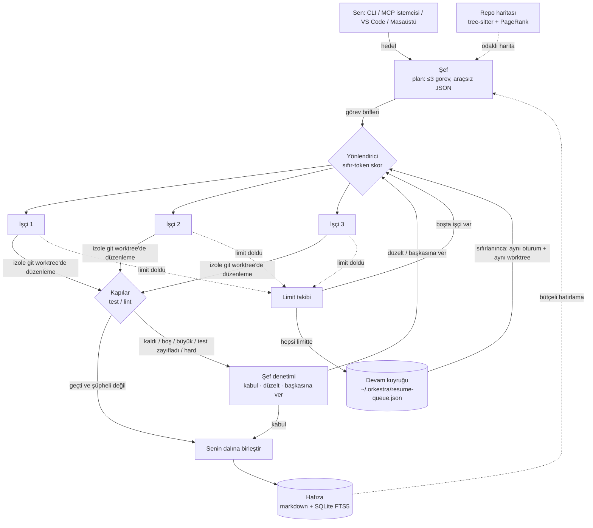

<p align="center"></p>

<h1 align="center">Super Orkestra 🎼</h1>

<p align="center">
  <b>En güçlü model şef, altında seçtiğin 3 işçi model.</b><br>
  Claude / ChatGPT / Gemini aboneliklerinde <b>en az token ve limitle en kaliteli kod</b>.
</p>

<p align="center">
  <a href="https://github.com/cumabozkurt/super-orkestra/actions/workflows/ci.yml"></a>
  <a href="https://github.com/cumabozkurt/super-orkestra/releases/latest"></a>
  <a href="https://www.npmjs.com/package/super-orkestra"></a>
  <a href="https://marketplace.visualstudio.com/items?itemName=cumabozkurt.super-orkestra-vscode"></a>
  <a href="https://open-vsx.org/extension/cumabozkurt/super-orkestra-vscode"></a>
  <a href="LICENSE"></a>
  
  
</p>

<p align="center">
  <a href="README.md">English</a> · <b>Türkçe</b> · <a href="docs/README.md">Belgeler (İngilizce)</a>
</p>

---

Super Orkestra açık kaynak bir AI kodlama orkestratörüdür. **Şef** model işi küçük bir plana böler ve kime vereceğine karar verir. **İşçi** modeller (Claude Code, Codex, Gemini CLI, opencode ya da OpenRouter) her görevi headless olarak **kendi git worktree'lerinde** yapar. Test/lint **kapıları** sonucu denetler. Kapılar geçerse ve şüpheli bir durum yoksa şef hiç uyanmaz. Bir şey ters giderse şef diff'i inceler ve *düzelt* ya da *başkasına ver* der.

Bir aboneliğin 5 saatlik ya da haftalık limiti dolarsa iş diğer işçiye devredilir. Hepsi doluysa iş kalıcı bir kuyrukta bekler. Limit sıfırlanınca **aynı CLI oturumunda, aynı worktree'de kaldığı yerden kendiliğinden devam eder**. Yarım iş asla atılmaz.

## Özellikler

- **Zaten kullandığın kodlama CLI'larıyla.** İşçiler Claude Code, Codex, Gemini CLI ya da opencode olabilir. Headless CLI ya da [Agent Client Protocol](https://agentclientprotocol.com) (ACP) kullanılır; ACP düşerse otomatik olarak CLI'a geçilir. OpenRouter modelleri API anahtarıyla çalışır. CLI'lar mevcut abonelik girişlerini kullanır.
- **Token tasarrufu.** Şef **araçsız** çalışır: tur başına tek bir JSON yanıt üretir, dosya okumaz. Yalnızca hedefe odaklı repo haritasını, ilgili hafızayı, diff'i ve kapı çıktısını görür. İşçiye kısa bir brif gider (plan ≤120 kelimelik bağlam ister). Düzeltme, kodu yazan işçiye geri gider. `budget.maxTokensPerTask` sınırı uygulanır.
- **Varsayılan olarak izolasyon.** Her görev `~/.orkestra/worktrees/` altında kendi git worktree'sinde koşar. Kabul edilen iş `--no-ff` ile birleştirilir, reddedilen iş atılır.
- **Önce kapı, sonra denetim.** Kapılar yapılandırmayla verilir ya da projeden çıkarılır (`npm test`, `cargo test`, `go test`, `pytest`). Şef yalnızca şu durumlarda uyanır: bir kapı kalırsa, diff boş ya da büyükse, görev `hard` ise, işçi başarısızlık bildirdiyse ya da mevcut testler silinmiş veya zayıflatılmışsa.
- **Limit takibi ve otomatik devam.** Claude Code statusline kancasıyla (`rate_limits`), Codex rollout kayıtlarından okunur. Tüm ajanların hata çıktısında 429, "try again in…" ve "resets 3pm (Europe/Istanbul)" gibi metinler aranır. Limitteki işçinin işi devredilir. Hepsi limitteyse kalıcı kuyruk, sıfırlanınca aynı oturumu sürdürür.
- **Kalıcı proje hafızası.** Markdown hafıza bankası + aranabilir SQLite FTS5 olgu deposu (yerleşik `node:sqlite`, ek veritabanı yok). Hafıza token bütçesiyle enjekte edilir.
- **Repo haritası.** Tanımlar 12 dilde tree-sitter ile çıkarılır, desteklenmeyen dosyalarda regex'e düşülür. Dosyalar referans grafiğinde PageRank ile sıralanır ve hedefe odaklanır.
- **Her yerde:** CLI · MCP sunucusu (Claude Code, Codex, VS Code ve diğer MCP istemcileri) · VS Code eklentisi (`@orkestra` sohbet katılımcısı) · Windows/macOS/Linux Tauri masaüstü uygulaması.

## Nasıl çalışır?



Ayrıntılar (yönlendirme formülü, denetim tetikleyicileri, devam karar tablosu, diskteki düzen) için [docs/architecture.md](docs/architecture.md) sayfasına bakın.

## Hızlı başlangıç

> [!NOTE]
> CLI **[npm](https://www.npmjs.com/package/super-orkestra)**'de, eklenti **[VS Code Marketplace](https://marketplace.visualstudio.com/items?itemName=cumabozkurt.super-orkestra-vscode)** ve **[Open VSX](https://open-vsx.org/extension/cumabozkurt/super-orkestra-vscode)**'te, Windows, macOS ve Linux masaüstü kurulumları **[GitHub Releases](https://github.com/cumabozkurt/super-orkestra/releases/latest)**'te.

**Gereksinimler:** Node.js **≥ 22.16** (FTS5 içeren yerleşik `node:sqlite` gerekir), git ve giriş yapılmış en az bir ajan CLI'ı.

```bash
# 1) Kullanmak istediğin ajan CLI'ları (istediğin kadarı)
npm i -g @anthropic-ai/claude-code @openai/codex @google/gemini-cli opencode-ai

# 2) Super Orkestra
npm i -g super-orkestra
super-orkestra --version          # kısa adı `orkestra`

# 3) Projende (bir git deposu) çalıştır
cd ~/kod/projem
super-orkestra run "login sayfasına 2FA ekle ve testlerini yaz"
```

<details>
<summary>Bunun yerine kaynaktan kur</summary>

```bash
git clone https://github.com/cumabozkurt/super-orkestra.git && cd super-orkestra
npm install && npm run build
npm link -w super-orkestra        # `super-orkestra` ve `orkestra` komutlarını PATH'e ekler
```
</details>

### İndirmeler

| Bileşen | Nerede | Kurulum |
|---|---|---|
| CLI + MCP sunucusu | [npm: `super-orkestra`](https://www.npmjs.com/package/super-orkestra) ([`super-orkestra-core`](https://www.npmjs.com/package/super-orkestra-core) ile birlikte gelir) | `npm i -g super-orkestra` |
| VS Code eklentisi | [VS Code Marketplace](https://marketplace.visualstudio.com/items?itemName=cumabozkurt.super-orkestra-vscode) · [Open VSX](https://open-vsx.org/extension/cumabozkurt/super-orkestra-vscode) (VSCodium, Cursor, Windsurf…) | `code --install-extension cumabozkurt.super-orkestra-vscode` ya da Uzantılar görünümünde *Super Orkestra* ara |
| Masaüstü · Windows | [GitHub sürümü](https://github.com/cumabozkurt/super-orkestra/releases/latest): `.msi`, `-setup.exe` | kurulumu çalıştır |
| Masaüstü · macOS | [GitHub sürümü](https://github.com/cumabozkurt/super-orkestra/releases/latest): `.dmg` (`aarch64` = Apple Silicon, `x64` = Intel) | `.dmg`'yi aç, uygulamayı Applications'a sürükle |
| Masaüstü · Linux | [GitHub sürümü](https://github.com/cumabozkurt/super-orkestra/releases/latest): `.AppImage`, `.deb`, `.rpm` | AppImage'a `chmod +x` ver ya da paketi kur |

Her sürümde ayrıca CLI tarball'ları, `.vsix` dosyası (çevrimdışı kurulum: `code --install-extension super-orkestra-vscode-<sürüm>.vsix`) ve her dosyanın sağlama toplamını içeren `SHA256SUMS.txt` bulunur.

Masaüstü derlemeleri **kod imzalı değil**. Windows SmartScreen onay isteyebilir (*Ek bilgi → Yine de çalıştır*). macOS'ta ilk açılışta uygulamaya sağ tıklayıp *Aç* deyin ya da `xattr -dr com.apple.quarantine "/Applications/Super Orkestra.app"` çalıştırın. Masaüstü uygulaması ve VS Code eklentisi CLI'ı kullanır; önce CLI'ı kurun.

Yapılandırma dosyası olmadan da çalışır. Varsayılanlar: Claude Code şef; Claude Code / Codex / opencode işçiler; kapılar projeden otomatik seçilir. Şefi ve işçileri seçmek için [`orkestra.config.example.json`](orkestra.config.example.json) dosyasını projene `orkestra.config.json` olarak kopyala.

**Giriş gerektirmeyen ücretsiz deneme:** [`examples/free-opencode.config.json`](examples/free-opencode.config.json), şef ve üç işçi için opencode'un ücretsiz modellerini kullanır.

## Yapılandırma

Proje kökündeki `orkestra.config.json` varsayılanlarla birleştirilir ve yüklenirken doğrulanır. Örnek: [`orkestra.config.example.json`](orkestra.config.example.json).

| Alan | Varsayılan | Açıklama |
|---|---|---|
| `conductor` | `claude-code` / `opus` | Şef ajanı: `claude-code`, `codex`, `gemini`, `opencode` |
| `workers[]` | 3 işçi | `id`, `agent`, `model`, `strengths`, isteğe bağlı `transport` (`auto`/`acp`/`cli`). **Sıra önemli:** en güçlü önce, en ucuz sonda |
| `providers.openrouter.apiKeyEnv` | `OPENROUTER_API_KEY` | OpenRouter anahtarının okunacağı ortam değişkeninin **adı** |
| `gates` | projeden çıkarılır | Kabulden önce koşacak kabuk komutları |
| `budget` | `60000` / `2` | Görev başına token sınırı ve en çok yeniden deneme |
| `limits` | `95` / `60` / `false` | Duraklatma yüzdesi, sıfırlanmadan sonra bekleme (sn), hesap geçişi (ayrılmış, etkisiz) |
| `memory` | `.orkestra/memory` / `1200` | Hafıza klasörü ve enjeksiyon token bütçesi |

Tüm alanlar ve `ORKESTRA_*` ortam değişkenleri: [docs/configuration.md](docs/configuration.md).

## Komutlar

`orkestra` kısa adı da aynı komuttur.

| Komut | Ne yapar |
|---|---|
| `super-orkestra run <hedef>` | Şef planlar, dağıtır, denetler, birleştirir. `run -` hedefi `ORKESTRA_INPUT` ya da stdin'den okur |
| `super-orkestra mcp` | MCP sunucusu (stdio) |
| `super-orkestra resume-daemon` | Limit sıfırlanınca tüm projelerin bekleyen işlerini sürdürür |
| `super-orkestra limits` / `usage` | 5 saatlik/haftalık limitler · token ve önbellek kullanımı (JSON) |
| `super-orkestra models [--free]` | opencode + OpenRouter modellerini keşfeder |
| `super-orkestra map` / `remember` / `recall` | Repo haritası · hafızaya yaz · hafızadan getir |
| `super-orkestra statusline` | Claude Code statusline kancası (limitleri kaydeder) |

**MCP:** `claude mcp add super-orkestra -- super-orkestra mcp` · `codex mcp add super-orkestra -- super-orkestra mcp`

**Claude limitlerini canlı okumak için** `~/.claude/settings.json`:

```json
{ "statusLine": { "type": "command", "command": "super-orkestra statusline" } }
```

**VS Code:** eklentiyi [Marketplace](https://marketplace.visualstudio.com/items?itemName=cumabozkurt.super-orkestra-vscode) ya da [Open VSX](https://open-vsx.org/extension/cumabozkurt/super-orkestra-vscode)'ten kur (`cumabozkurt.super-orkestra-vscode`). Sohbette `@orkestra <görev>`, `/limits`, `/usage`, `/recall`. Ayrıntı: [docs/vscode-extension.md](docs/vscode-extension.md).

**Masaüstü:** Geliştirme için `npm run dev:desktop` (Rust + Tauri önkoşulları gerekir). Uygulama CLI'ı çağırır, bu yüzden önce CLI kurulmalıdır. Ayrıntı: [docs/desktop-app.md](docs/desktop-app.md).

## Doğrulama

- **75 birim/entegrasyon testi** UTC, İstanbul, Los Angeles ve Tokyo saat dilimlerinde geçiyor. CI; Linux/macOS/Windows × Node 22/24 üzerinde derleme, tip denetimi ve testleri koşar. Ayrıca npm paketlemesini kontrol eder, VS Code `.vsix` paketini üretir ve masaüstü için `cargo check` çalıştırır.
- opencode ücretsiz modelleriyle gerçek uçtan uca koşular yapıldı (ACP ve CLI): şef planladı → işçi worktree'de düzeltti → kapı geçti → birleşti. Limit devri ve hepsi-limitte otomatik devam senaryoları [`scripts/scenarios/`](scripts/scenarios/) klasöründe.
- Claude Code / Codex / Gemini **kod düzeyinde** test edildi (sahte CLI akışlarıyla). Bayraklar gerçek `--help` çıktılarıyla doğrulandı. Gerçek ücretli hesapla canlı koşu yapılmadı.

## Bilinen sınırlar

- Gemini CLI `--resume` oturum kimliği yerine `latest` ya da indeks alır. Her görev kendi worktree'sinde koştuğu için pratikte doğru oturum seçilir.
- Codex `exec` modunda `rate_limits` bazen boş gelir. O durumda hata metni/429 algılaması devreye girer.
- Birden çok abonelik hesabı arasında otomatik geçiş hizmet şartlarıyla çakışabileceği için **uygulanmadı**. `limits.allowAccountFailover` ayrılmış bir alandır, şu an etkisi yoktur.
- Proje bir git deposu değilse ya da depoda henüz commit yoksa işçiler **izolasyon olmadan** doğrudan proje klasöründe çalışır.

## Katkı ve lisans

[CONTRIBUTING.md](CONTRIBUTING.md) · [Davranış Kuralları](CODE_OF_CONDUCT.md) · [CHANGELOG.md](CHANGELOG.md) · Güvenlik: [SECURITY.md](SECURITY.md)

Tasarım kararları 60'a yakın açık kaynak projenin incelenmesine dayanır. Araştırma raporları [`docs/research/`](docs/research/) klasöründe.

Lisans: [MIT](LICENSE) © 2026 Cuma Bozkurt
