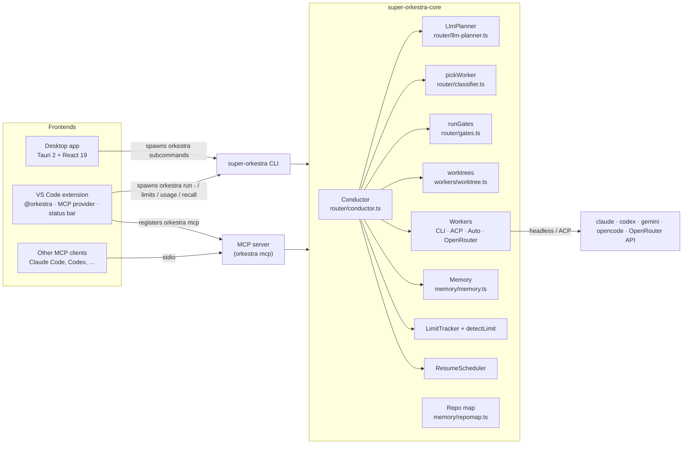
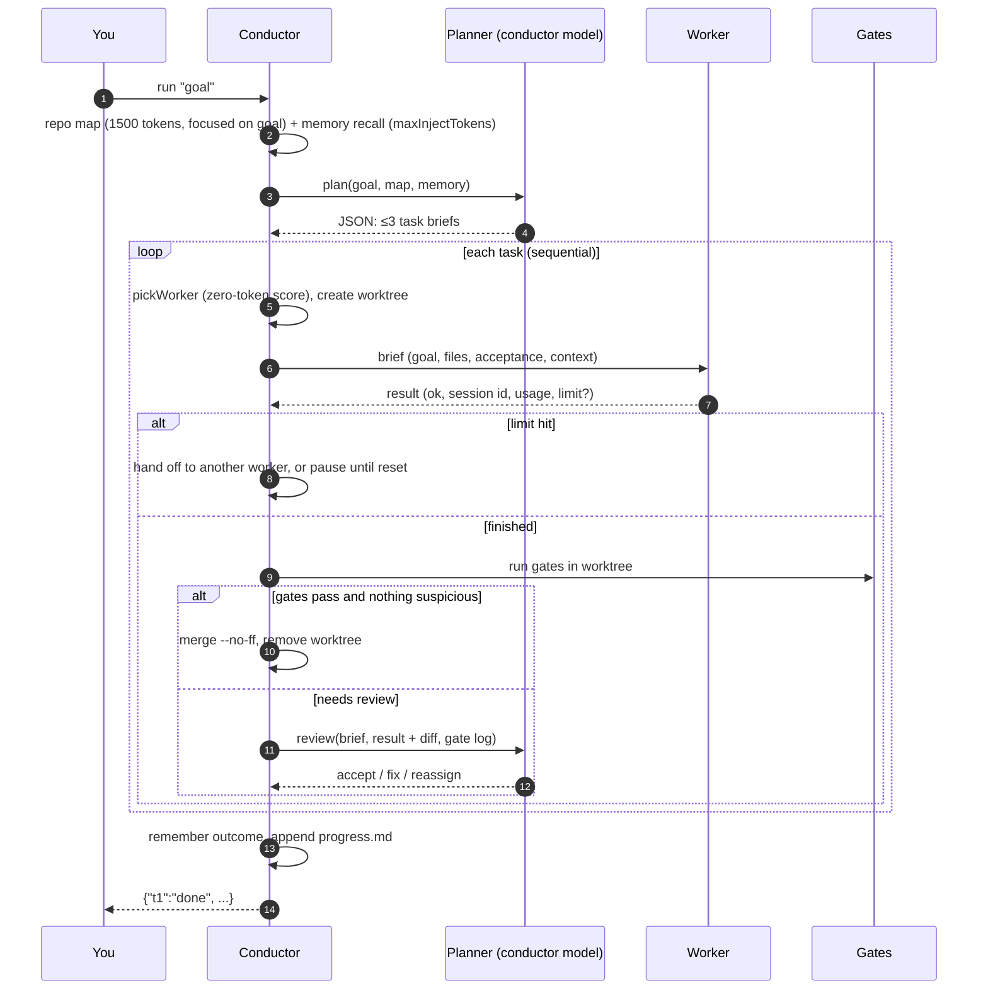
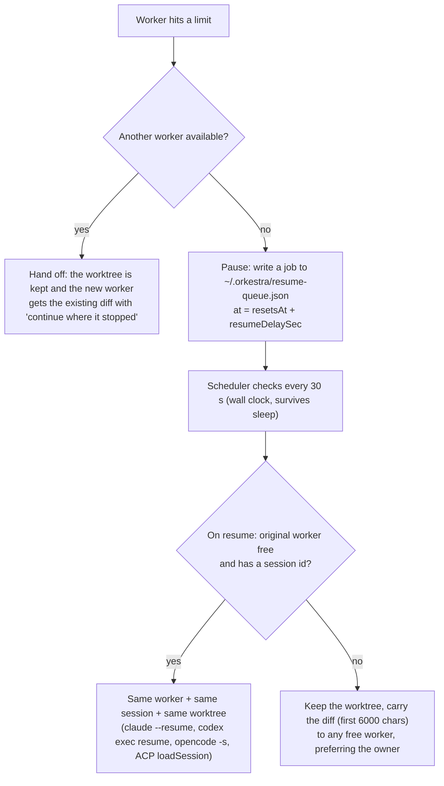

# Architecture

Super Orkestra is a small TypeScript monorepo. All the logic lives in **`super-orkestra-core`**. The CLI, the VS Code extension and the desktop app are thin shells around it.



## The loop



### Planning

`LlmPlanner` calls the conductor's CLI **with no tools** and asks for a JSON array of briefs:

```json
[{"id":"t1","goal":"...","files":["..."],"context":"≤120 words","acceptance":["testable criterion"],
  "complexity":"trivial|small|medium|hard","tags":["refactor|bugfix|tests|docs|feature|small-edit|..."]}]
```

The prompt asks for as few independent tasks as possible (usually 1, at most 3). It forbids separate "run the tests" tasks, because gates already do that, and it forbids touching existing tests unless the goal asks for it. If the answer is not valid JSON, the conductor is asked once more. The result is then **normalized**:

- items without a `goal` are dropped;
- an empty plan becomes one task containing the goal itself;
- ids are made safe for git branch names and deduplicated;
- an unknown `complexity` becomes `small`;
- missing arrays become `[]`.

### Routing

`pickWorker` scores every worker that is not excluded (excluded means limit-blocked, already tried for a reassign, and so on). No tokens are spent:

```
score = 2 × (number of task tags in worker.strengths) + costFit

costFit = −index                               if complexity = hard
        = index × (3 − rank(complexity)) / 3   otherwise   (rank: trivial 0, small 1, medium 2)
```

`index` is the worker's position in `workers[]`. So `hard` tasks favor workers near the top of the list (treated as the strongest). `trivial` and `small` tasks favor workers near the bottom (treated as the cheapest). Tag matches usually decide the rest.

### Workers

| Class | Used for | Notes |
|---|---|---|
| `CliWorker` | `claude-code`, `codex`, `gemini`, `opencode` | Spawns the CLI **without a shell**, parses its JSON event stream into text, session id and token usage, and has a 20-minute timeout. On Windows, `.cmd` shims are resolved to `node <script>` so multi-line prompts survive and shell injection is impossible. |
| `AcpWorker` | `acp`, or any agent with `transport: "acp"` | Agent Client Protocol over stdio. Selects the model through the session config options. File read/write requests are confined to the worktree (symlinks are resolved). Permission requests get `allow_once` and are cancelled when no such option exists. |
| `AutoWorker` | default for `opencode` and `gemini` | ACP first. If that run produced no output and hit no limit, the same task is rerun over the CLI. |
| `OpenRouterWorker` | `openrouter` | One chat-completion call that asks for a unified diff, which is applied with `git apply` (falling back to `--3way`). A 429 response counts as a limit for 60 seconds. |

Workers get a brief, never the conversation transcript:

```text
GÖREV: <goal>
DOSYALAR: <files, or "(gerekirse bul)">
KABUL KRİTERLERİ:
- <criterion>
BAĞLAM:
<context>

Değişikliği doğrudan dosyalara uygula. Gereksiz dosya okuma, açıklama yazma. Sonunda en fazla 3 satır özet ver.
```

(GÖREV = task, DOSYALAR = files, KABUL KRİTERLERİ = acceptance criteria, BAĞLAM = context. The last line says: apply the change directly to the files, avoid unnecessary reads and explanations, and end with a summary of at most 3 lines.)

### Worktrees

For each task attempt, `createWorktree` runs `git worktree add -b orkestra/<task>-<worker>-<time> <path> HEAD`, with the path under `~/.orkestra/worktrees/<repo-name>-<sha1(repo path)[0:8]>/`. Worktrees live **outside** the repository because some agents treat a nested directory as the real project root. `node_modules`, `.venv` and `venv` from the main checkout are linked in so gates can run.

- **Diff:** `git add -A` (excluding the linked dependency folders), then `git diff --cached <base>`.
- **Accept:** the changes are committed in the worktree, then `git merge --no-ff` runs in the main repository. On a conflict the merge is aborted and the task is retried with a note, if attempts remain.
- **Reject:** `git worktree remove --force`, the branch is deleted, `git worktree prune` runs, and an empty parent folder is removed.

If the directory is not a git repository, or worktree creation fails (for example, there are no commits yet), the worker runs **in the project directory itself** and a warning is emitted.

### Gates and review triggers

After a worker finishes, the gates run in its worktree. The conductor is woken for a review **only** if at least one of these holds:

| Trigger | Why |
|---|---|
| A gate failed | Something is objectively wrong |
| The diff is larger than 8000 characters | Large changes deserve a look |
| The diff is empty (in a worktree) | The worker probably did nothing |
| `testsWeakened(diff)` | Lines with `assert` / `expect` / `test(` / `it(` / `def test_` were removed from test files (`test/`, `tests/`, `__tests__/`, `spec/`, `*.test.*`, `*.spec.*`, `*_test.go`, `*_test.py`, `test_*.py`). Adding tests is fine. |
| `complexity` is `hard` | Planned as risky |
| The worker reported failure | Non-zero exit or error event |

Otherwise the task is accepted with the note "kapılar geçti" (gates passed) and **no conductor tokens are spent**.

### Verdicts

| Verdict | Action |
|---|---|
| `accept` | Merge and remove the worktree. If the gates failed, `accept` is overridden to `fix`. |
| `fix` | Remove the worktree and retry with the conductor's note appended to the context. With an unchanged exclusion list, the router normally picks the same worker. |
| `reassign` | Same, but the current worker is excluded. If no other worker is available, it falls back to `fix` with the same worker. |
| unreadable | Treated as `fix` |

Retries stop at `budget.maxRetries`, or earlier once `budget.maxTokensPerTask` is spent.

## Limits and auto-resume

### Sources

| Source | Agent | How |
|---|---|---|
| Statusline hook | Claude Code | `super-orkestra statusline` receives Claude Code's statusline JSON and atomically writes `rate_limits` (`five_hour`, `seven_day`: `used_percentage`, `resets_at`) to `~/.orkestra/claude-limits.json` |
| Rollout logs | Codex | The newest `rollout-*.jsonl` under `$CODEX_HOME/sessions` (searched up to 4 levels deep). The last `rate_limits.primary` / `secondary` entry is used. |
| Output detection | all | Searched **only when a run fails**, so a "429" in normal output is not a false alarm. Recognizes `usage limit reached\|<epoch>`, `try again in 2 hours 5 minutes`, `resets 3pm (Europe/Istanbul)` / `try again at 3:05 PM` (resolved in the named time zone, DST-aware), and `429` / `rate_limit_exceeded` / `RESOURCE_EXHAUSTED` / `quota exceeded` (assumed to last 5 minutes). |

Limits are keyed **per account** for subscription CLIs (all `claude-code` workers stop together) and **per model** for `opencode` and `openrouter`. A worker is blocked when any window is at or above `pauseAtPercent` and its reset time is in the future. Limits detected from output are kept separately so a stale statusline or rollout refresh cannot erase them.

### What happens when a limit is hit



- The queue is **global** (shared by all projects). Writes are atomic and protected by a cross-process lock directory; a lock older than 60 seconds is treated as stale.
- `super-orkestra run` stays alive while jobs for the current project are pending. `super-orkestra resume-daemon` resumes jobs for **all** projects, building a conductor for each project directory.
- If a resumed job throws, it is requeued 10 minutes later.

## Memory

Two layers, under `memory.dir` (default `.orkestra/memory`):

1. **Markdown memory bank:** `project.md`, `decisions.md`, `progress.md`, `conventions.md`, created on first use. `conventions.md` is injected into every plan prompt. `progress.md` gets a ✅ or ⚠️ line per goal. The other files are there for you and your agents to maintain.
2. **Fact store:** a SQLite FTS5 virtual table in `facts.db`. `remember` updates an existing fact when its first 80 characters match a stored fact (a cheap version of mem0's update step); otherwise it inserts a new one. `recall(query, maxTokens)` returns `conventions.md` (truncated to the budget) plus the best BM25 matches for the query's words (3+ letters, Unicode-aware) until the budget, estimated at about 4 characters per token, is used up.

The conductor writes facts automatically: one per solved task (`<task> (<tags>) solved by <worker>/<model>: <summary>`) and one per goal outcome.

## Repo map

`buildRepoMapAsync(cwd, maxTokens, focus)`:

1. Lists tracked files with `git ls-files`, keeping source extensions (`.ts .tsx .mts .cts .js .jsx .mjs .cjs .py .go .rs .java .kt .cs .rb .php .swift .c .cpp .cc .h .hpp`) and skipping `node_modules`, `dist/`, `vendor/`, `*.min.*`, and files over 400 KB.
2. Extracts definitions with **tree-sitter** (`@vscode/tree-sitter-wasm`) for TypeScript, TSX, JavaScript, Python, Go, Rust, Java, C#, Ruby, PHP, C and C++ (C is parsed with the C++ grammar). Identifiers inside comments and strings are ignored. Other languages (for example Kotlin and Swift), and any file whose grammar fails to load, use a regex fallback.
3. Builds a reference graph (file A → file B when A uses a symbol defined in B).
4. Runs **PageRank** (20 iterations, damping 0.85). The teleport vector is personalized: files whose path or symbols match words from `focus` get +5 each.
5. Prints files in rank order, up to 25 signatures each, until the token budget runs out, then adds a "… +N files" line.

`run` builds a 1500-token map focused on the goal. `super-orkestra map` lets you inspect it.

## Usage ledger

Every plan, work, review, budget and pause event is appended to `.orkestra/usage.jsonl` with a timestamp. Worker events carry `usage` (`input`, `output`, `cacheRead`, `cacheWrite`). Conductor usage is recorded as deltas, so totals stay correct across many runs. `super-orkestra usage` aggregates the ledger per worker and for the conductor.

## Design references

The code comments name the ideas it borrows:

- the architect/editor split and tree-sitter repo map ([Aider](https://github.com/Aider-AI/aider));
- Task Ledger / Progress Ledger (Magentic-One in [AutoGen](https://github.com/microsoft/autogen));
- a worktree per agent ([claude-squad](https://github.com/smtg-ai/claude-squad), [nimbalyst](https://github.com/nimbalyst/nimbalyst));
- a markdown memory bank ([Cline Memory Bank](https://github.com/cline/cline), spec-kit, OpenSpec);
- the fact update step ([mem0](https://github.com/mem0ai/mem0));
- cheap rule-based routing ([RouteLLM](https://github.com/lm-sys/RouteLLM), the OpenHands Model Router).

See [`docs/research/`](research/) for the full survey.
